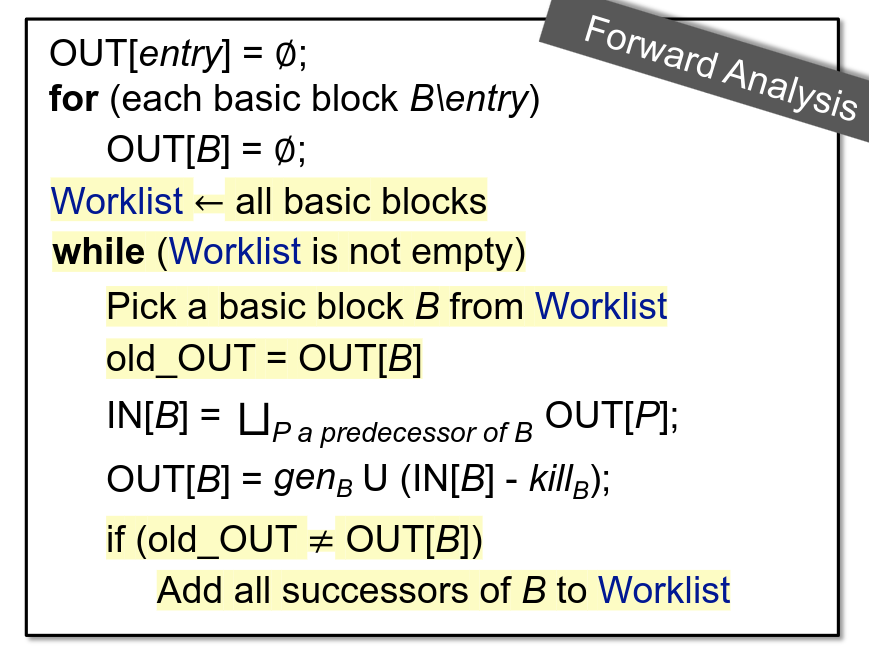

+++
date = '2026-06-27T19:03:41+08:00'
draft = false
categories = ["Static Analysis"]
tags = ["tai-e", "assignment"]
title = 'Tai-e Assignment 2: 常量传播和 Worklist 求解器'
+++

## 1 实验内容

- 为 Java 实现常量传播算法。
- 实现一个通用的 worklist 求解器，并用它来解决一些数据流分析问题，例如本次的常量传播。

## 2 实验概览

基本上和上一个实验要做的事情一样，翻译下面这个算法：



## 3 实验过程重点

### 构造 newBoundaryFact

在实现 newBoundaryFact() 的时候，要小心地处理每个会被分析的方法的参数。具体来说，要将它们的值初始化为 NAC ，这是因为常量传播算法是个保守的must分析，而方法的参数的值肯定会被定义，但是我们又不可能得知他是不是个常量（又或者说就算知道了也不可能知道是哪个具体常量）。

要做到这一点，我们就必须要知道一个方法中有哪些参数。

实验框架提供了 pascal.taie.ir.IR 这个类，里面有一个方法正好可以满足我们的需求：

```java
/**
 * @return the parameters in this IR ("this" variable is excluded).
 * The order of the parameters in the resulting list is the same as
 * the order they are declared in the method.
 */
List<Var> getParams();
```

### transferNode 中对于 function call 的处理

讲义上有个地方我觉得写得有问题：

> - pascal.taie.ir.stmt.DefinitionStmt 
> 
> 这是 Stmt 的一个子类。它表示了程序中所有的赋值语句，（即形如 x = y 或 x = m(…) 的语句）。这个类很简单。你可以通过阅读源码来决定如何使用它。

我误以为 DefinitionStmt 都是由左值的，但是在看过源码之后发现并不是这样的：

```java
public abstract class DefinitionStmt<L extends LValue, R extends RValue>
        extends AbstractStmt {

    /**
     * @return the left-hand side expression. If this Stmt is an {@link Invoke}
     * which does not have a left-hand side expression, e.g., o.m(...), then
     * this method returns null; otherwise, it must return a non-null value.
     */
    public abstract @Nullable L getLValue();

    /**
     * @return the right-hand side expression.
     */
    public abstract R getRValue();
}
```

可以看到 DefinitionStmt 是可以没有左值的。这一点让我在实现 transferNode 这里迷糊了很久。