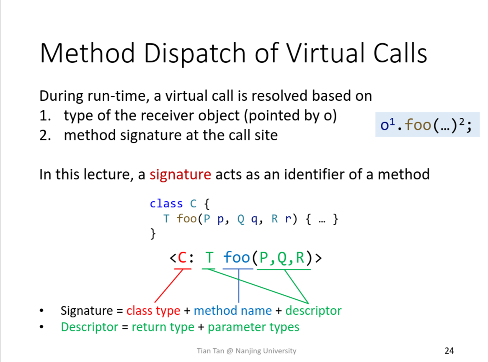
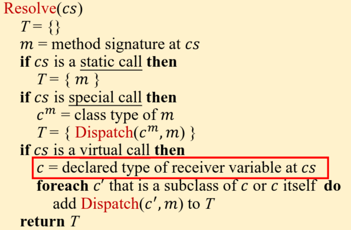

+++
date = '2026-07-16T19:03:41+08:00'
draft = false
categories = ["Static Analysis"]
tags = ["tai-e", "assignment"]
title = 'Tai-e Assignment 4: 类层次结构分析与过程间常量传播'
+++

## 1 实验内容

- 为 Java 实现一个类层次结构分析（Class Hierarchy Analysis，CHA）。
- 实现过程间常量传播。
- 实现过程间数据流传播的 worklist 求解器。

## 2 实验概览

## 3 实验过程重点

### 瞎猫碰上死耗子

我最疑惑不解的就是文档中的这段描述：

> - JClass getDeclaringClass()：返回该方法签名的声明类，即声明该方法的类。（也就是第 7 讲课件的第 24 页中所描述的 class type）；

那好，我们来看看这里对于 class type 的描述是什么：



说实话，我没怎么看懂，只是感觉好像就是在描述“某个具体方法在哪个具体的类里”。

当时也没多想，反正是翻译伪代码嘛，我也不管三七二十一，直接把对 special call 的处理翻译了出来。

但是当我翻译下面这行伪代码的时候，我却犯了难：



看这描述，我隐约有感觉是要通过 call site 来寻找这个 declared type，但是我找遍了 Invoke 这个类也没找到能返回 JClass 的方法。

后面尝试了很多稀奇古怪的方法，最终还是将目光落在了 JClass getDeclaringClass() 这个方法上。

为什么？

因为 declared type 和 getDeclaringClass 都有 declare 这个词缀，并且我要找的就是能返回 JClass 的方法。

真是太有理有据了，我简直就是天才，就这么干吧。

这也不能全怪我，主要是这个 getDeclaringClass 连个注释都没有，我实在不知道是用来干嘛的。

结果没想到真的成了，这就是我要找的那个方法。

### 不太体面的实现

```java
protected CPFact transferCallEdge(CallEdge<Stmt> edge, CPFact callSiteOut) {
    List<RValue> uses = edge.getSource().getUses();
    List<Var> params = edge.getCallee().getIR().getParams();
    CPFact newFact = new CPFact();
    for (int i = 0; i < params.size(); i++) {
        if (uses.get(i) instanceof Var var) {
            newFact.update(params.get(i), callSiteOut.get(var));
        }
    }
    return newFact;
}
```

这个函数实现的有些“不太体面”，这里之所以能这样处理的前提是实参是按顺序放在 uses 里面的，但是这一点并没有在注释和文档中提到，但是我觉得既然都已经有了CallEdge<Stmt>这种抽象了，为何不直接把对应关系放入这个对象里呢？

## 4 碎碎念 

总的来说这个实验还是花了我很多时间的，很多时候为了知道一个对象能提供哪些信息就直接一股脑地把所有方法调用一边再设个断点在调试器里一个个看。。。感觉不是一种健康的 working flow。

希望有一种 ai 可以一直看着我写代码，指出我工作流上的一些不足的地方。