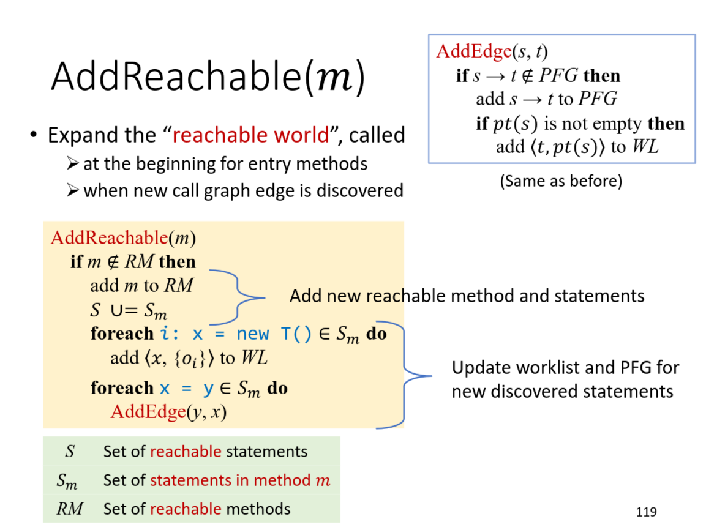
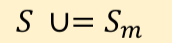
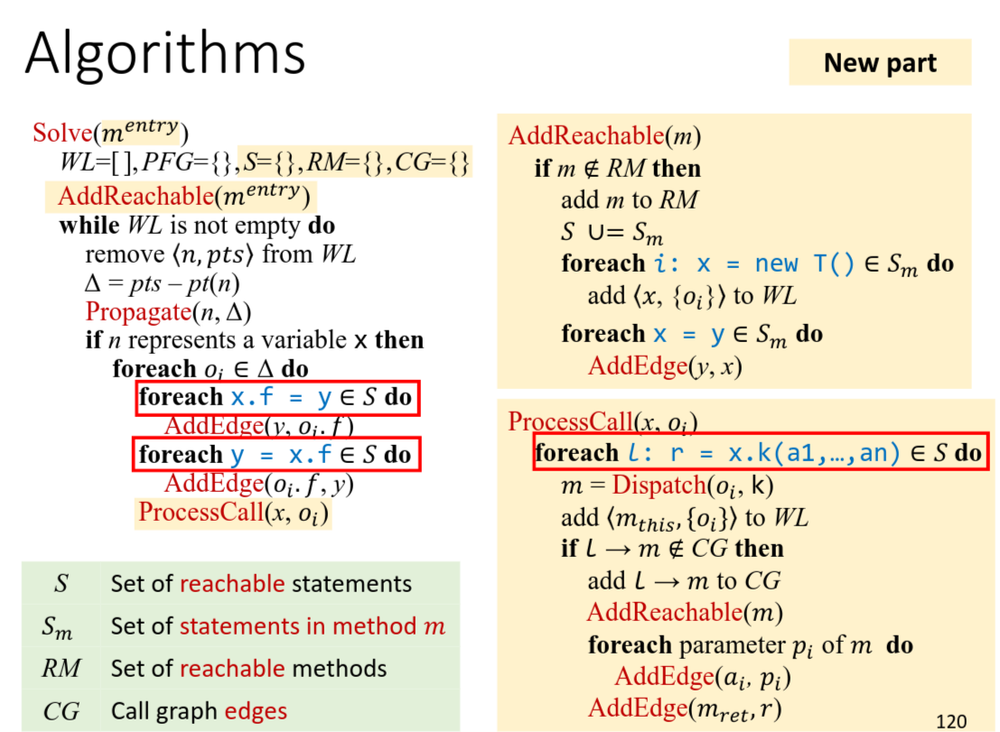

+++
date = '2026-07-21T07:03:41+08:00'
draft = false
categories = ["Static Analysis"]
tags = ["tai-e", "assignment"]
title = 'Tai-e Assignment 5: 非上下文敏感指针分析'
+++

## 1 实验内容

- 为 Java 实现非上下文敏感的指针分析。
- 为指针分析实现一个调用图的实时构建算法。

## 2 实验概览

## 3 实验过程重点

### 实现 AddReachable 函数



这里要注意的一点是我们并不需要显式地实现下面这行伪代码：



因为当我们将当前 method 加入 reachable methods 中时，其实就已经相当于把这个 method 中的 statments 加入到了 reachable statments 里面了，后面要用到这个集合的时候其实也是用来遍历与判重：



我们可以用这种方法来遍历 reachable statments ：

```java
callGraph.reachableMethods().forEach(method -> {
    method.getIR().getStmts().forEach(stmt -> {
        ...
    });
});
```

注意先将需要处理的 stmt 从里面取出来存好再进行处理，因为如果直接在里面进行处理的话，由于你可能会在不经意间执行 addReachableMethod 这种操作，这会触发并发修改异常（java.util.ConcurrentModificationException）。

### 处理静态方法

在实现 void addReachable(JMethod) 的时候，要注意将该方法中所涉及到的静态方法加入到 ReachableMethod ，因为他不像普通方法调用一样，它是可以没有 receiver valuable 的，所以不会在 processCall 函数中被加入到 callGraph 中。但也正是因为这一点，我们可以在通过 addReachable 来将它们加入到 ReachableMethod 中。

伪代码如下：

```
AddReachable(m)
    if m ∉ RM then
        add m to RM
        𝑆 ∪= 𝑆𝑚
        foreach i: x = new T() ∈ 𝑆𝑚 do
            add <𝑥, {𝑜𝑖}> to WL
        foreach x = y ∈ 𝑆𝑚 do
            AddEdge(y, x)
        foreach m_static ∈ 𝑆𝑚 do
            AddReachable(m_static)
```